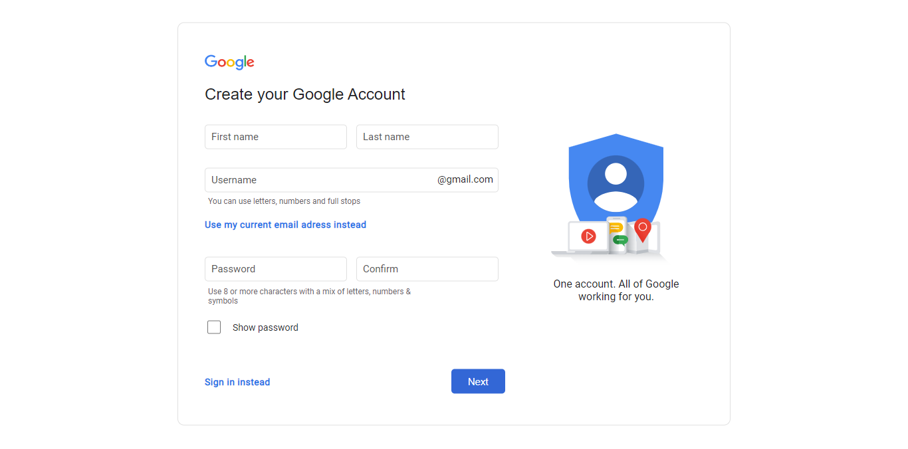

# Create your Google Account Web Page

This assignment is part of the Web Programming course.

## Interface

- You can check the original version of [Create your Google Account web page](https://accounts.google.com/signup/v2/webcreateaccount?flowName=GlifWebSignIn&flowEntry=SignUp&hl=en-GB).